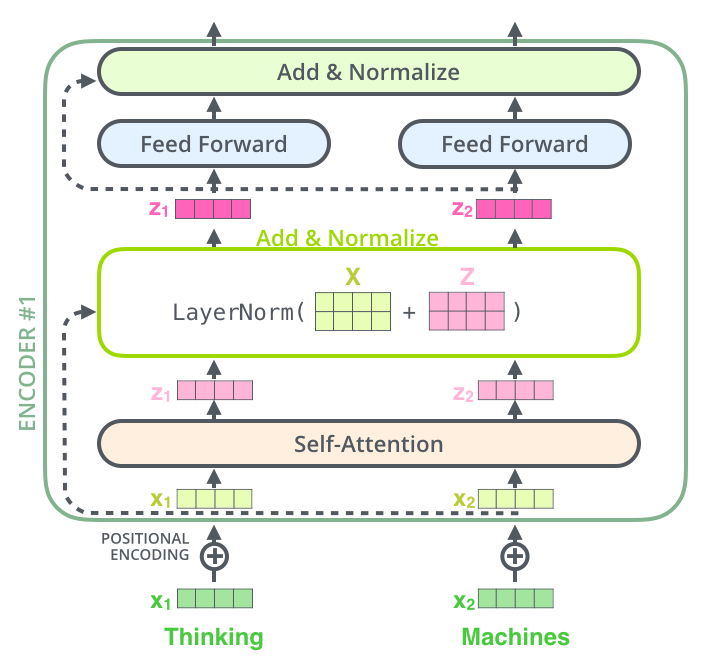

# GPT From Scratch

## Model Architecture 

In order to build decoder one needs to have:

1. Word embeddings layer.
2. Positional embeddings layer.
3. Multiple transformer blocks (self-attention, optionally encoder-decoder attention, feed-forward layer and do not forget about residual connections and normalization). The number of blocks is a hyperparameter.
4. Final head fully-connected layer to transform final token embeddings into predictions.

## Decisions to be made

1. Transform input shape --> (B, T, C) to word level? Where B is batch_size, T is the max number of "Words" to be generated, and C is the number of Channels or encoding size (Vocab) which is the number of unique words and that varies for different tokenizers and datasets.
2. T (block size) size? The maximum number of words the model can output at a time. This translates to the "tokens" paramter in the [OpenAI API documentation](https://platform.openai.com/docs/api-reference/making-requests).
3. Training Dataset (Refer to next section)

## Training Dataset Options

I would suggest training on a subset of the Wikipedia open text datoaset (~24 GB) or a subset of it to begin with (for training time & hardware limitations). This should give is a very strong model with alot of knowledge that we can test with simple "facts". 

- [Plain Text Wikipedia 2020-11](https://www.kaggle.com/datasets/ltcmdrdata/plain-text-wikipedia-202011)

Alternatively, if we want to spice things up a bit, here are some other options: 

- [Donald Trump Comments on Reddit](https://www.kaggle.com/datasets/amalinow/donald-trump-comments-on-reddit)

- [QAnon Posts Dataset](https://www.kaggle.com/datasets/jkingsman/qanondrops)

- [Reddit WallStreetBets Posts](https://www.kaggle.com/datasets/gpreda/reddit-wallstreetsbets-posts)

- [Reddit Vaccine Myths](https://www.kaggle.com/datasets/gpreda/reddit-vaccine-myths)

- [COVID19 Tweets](https://www.kaggle.com/datasets/gpreda/covid19-tweets)

- [Rick&Morty Scripts](https://www.kaggle.com/datasets/andradaolteanu/rickmorty-scripts)

I would have loved to use a Twitter API and collect tweets from certain celebrities for training "clones" of them, but unfortunately Elon is discontinuing that option for developers sometime during thid Feb, so it's not worth investing time in.

## Notes about Transformer architecture

Transformer architecture: Encoder on the left and decoder is on the right side.

The focus is on decoder part of transformer architecture as the intent is to generate new text similar to the training text in tiny-shakespeare dataset (or anything else).

Decoder consists of transformer blocks and each transformer block consists of two distinct layers (actually three, but for now we will not mention encoder-decoder attention as we don't use encoder):

1. Self-attention layer.
2. Feed-forward layer.

## Transformer Block (Self-attention)

Self-attention layer is used to have such embeddings for each token that the embedding vector contains not only information about the token itself but also about token\tokens in which it is interested the most (highest attention).

It is done via transforming each token embedding into key, query and value vector through dot products of vector of token x and weight matrices K, Q an V.

Intuitively speaking:

- key: what the token represents
- query: what the token is interested in
- value: if someone is interested in the token, that's the value will be returned

As we obtain key and value vectors from token x itself (and not from external source) means that we perform self-attention.

Then by multiplying key and query for each token and passing it through softmax operation, we obtain attention map, which we can use in order to do weight averaging of values. Refering to this article [Illustrated transformer](https://jalammar.github.io/illustrated-transformer/) for more information. 